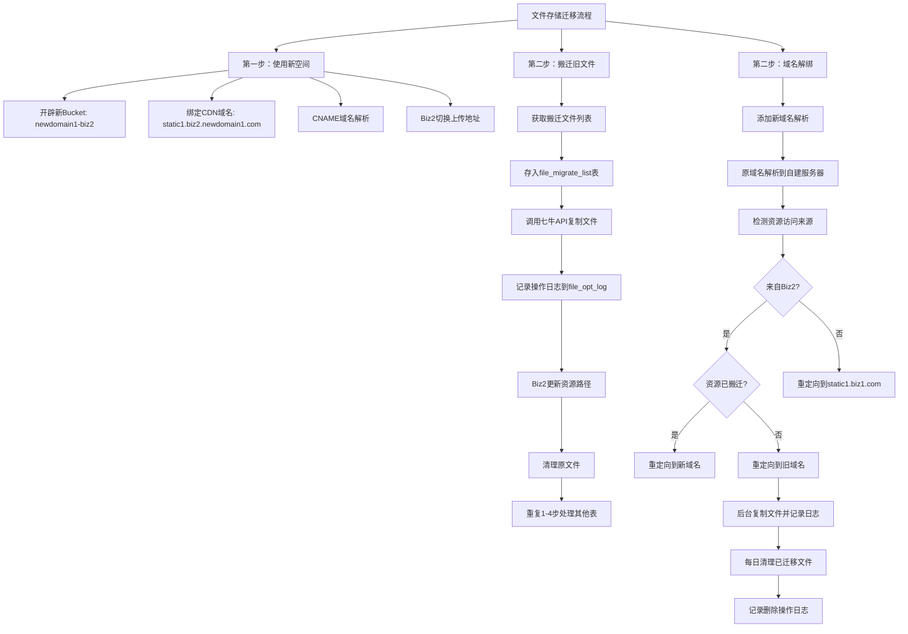

## 文件存储迁移流程

第一步：使用新空间
1. 七牛Bucket: 开辟新的文件存储空间: `newdomain1-biz2`
2. 七牛CDN: 绑定新域名 static1.biz2.newdomain1.com 分发到 `newdomain1-biz2` 这个Bucket文件空间
3. 域名解析：static1.biz2.newdomain1.com 通过CNAME别名解析，绑定到七牛云`newdomain1-biz2`文件空间：static1-biz2-newdomain1-com-idxxxxx.qiniudns.com
4. Biz2: 文件上传地址从原`biz1-bucket`(`static.biz1.com`)切换为新的`newdomain1-biz2`(static1.biz2.newdomain1.com)

第二步：搬迁旧文件（方法一）
1. Biz2: 获取搬迁文件列表。存入七牛助手数据库qiniudb的 `file_migrate_list` 数据表: file_url(必填), from_table(必填), from_column_name(必填), file_key, created_at
2. 七牛助手: 读取 `file_migrate_list` 数据表，并调用七牛云API【复制】文件到新的文件空间`newdomain1-biz2`。记录操作结果到 `file_opt_log` 日志表: file_key, opt_type(0copy,1move,3delete), status(1success|0fail), file_size, upload_time, created_at, qiniu_etag, md5, from_bucket, to_bucket
3. Biz2: 更新数据库表，原有的`biz1-bucket`空间的文件资源路径，改为新的存储空间`newdomain1-biz2`的资源路径。
4. 七牛助手：清理文件。读取 `file_opt_log` 日志表，并调用七牛云API【删除】迁移成功的原有文件（opt_type=0且status=1）。
5. 整理附件和迁移文件数据表。Biz1有60个表字段，Biz2有282个表字段。重复1-4步。第4步可以等1-3步循环执行多次后再执行一次。

第二步：域名解绑（方法二）
1. 七牛CDN: 添加 `static1.biz1.com` 新域名解析到`biz1-bucket`文件空间（即Bucket）, 然后更换 `static.biz1.com` 原域名（原本绑定在七牛云）解析到自建的文件资源调度服务器（IP: new.IP.xx.xx）
2. 七牛助手: 通过设定规则（HTTP请求头和发起请求的IP），检测静态资源文件访问请求的来源。
3. 七牛助手：若来自Biz2：如资源已搬迁到新的`newdomain1-biz2`空间，则直接重定向访问请求到新的static1.biz2.newdomain1.com。如资源未搬迁，则先重定向访问请求到旧的`static1.biz1.com`，接着执行后台任务，调用七牛云API【复制】文件到新的文件空间`newdomain1-biz2`。记录操作日志 `file_opt_log` (opt_type=0且status=1)。
4. 七牛助手：若来自非Biz2，则重定向访问请求到 `static1.biz1.com`
5. 七牛助手：每日检测一次，清理文件。读取 `file_opt_log` 日志表，并调用七牛云API【删除】迁移成功的原有文件（opt_type=0且status=1）。并记录操作日志（opt_type=3, status=1）
6. 注：此方法不够彻底。后期还需要方法一再做最后清理。

## 数据表

`file_migrate_list` 表结构

| 字段名 | 数据类型 | 是否必填 | 默认值 | 说明 |
|--------|----------|----------|---------|------|
| id | SERIAL | 是 | 自动递增 | 主键ID |
| file_url | VARCHAR(1000) | 是 | 无 | 文件原始URL |
| status | SMALLINT | 否 | 0 | 迁移状态：0未开始，1copy成功，2move成功，3原文件已删除 |
| from_table | VARCHAR(64) | 是 | 无 | 来源表名 |
| from_column_name | VARCHAR(64) | 是 | 无 | 来源字段名 |
| file_key | VARCHAR(500) | 是 | 无 | 文件存储的key |
| from_bucket | VARCHAR(32) | 否 | 无 | 来源bucket文件空间 |
| created_at | TIMESTAMP | 否 | CURRENT_TIMESTAMP | 创建时间 |
| updated_at | TIMESTAMP | 否 | CURRENT_TIMESTAMP | 更新时间 |

`file_opt_log` 表结构

| 字段名 | 数据类型 | 是否必填 | 默认值 | 说明 |
|--------|----------|----------|---------|------|
| id | SERIAL | 是 | 自动递增 | 主键ID |
| file_key | VARCHAR(500) | 是 | 无 | 文件存储的key |
| opt_type | SMALLINT | 是 | 无 | 操作类型：1copy, 2move, 3delete |
| state | BOOLEAN | 是 | false | 操作状态：true成功 \| false失败 |
| file_size | INT8 | 否 | 无 | 文件大小 |
| upload_time | TIMESTAMP | 否 | 无 | 上传时间 |
| created_at | TIMESTAMP | 否 | CURRENT_TIMESTAMP | 创建时间 |
| qiniu_etag | VARCHAR(64) | 是 | 无 | 七牛返回的ETag |
| md5 | VARCHAR(32) | 是 | 无 | 文件的MD5 |
| from_bucket | VARCHAR(32) | 否 | 无 | 来源bucket文件空间 |
| to_bucket | VARCHAR(32) | 否 | 无 | 目标bucket文件空间 |

## 流程图

